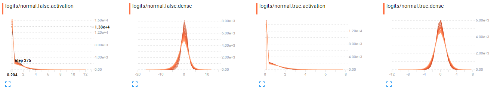
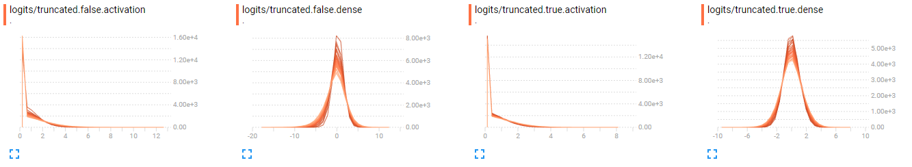
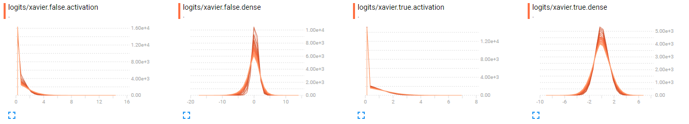
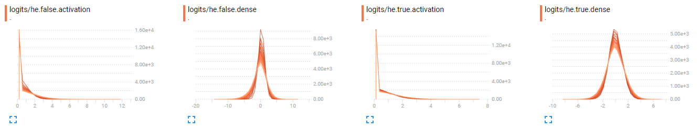

# Weight init schemes & batch normalization
## Trying MNIST data set on one layer with different weight initialization scheme and batch normalization

### Train Accuracies

* With or without batch normalization (normal init)

* With batch normalization

* Without batch normalization

### Logits and Activation layer

* With normal initialization

* With truncated normal initialization

* With xavier initialization

* With he initialization

## Reference code
[hwalsuk.lee](https://github.com/hwalsuklee/tensorflow-mnist-MLP-batch_normalization-weight_initializers)
