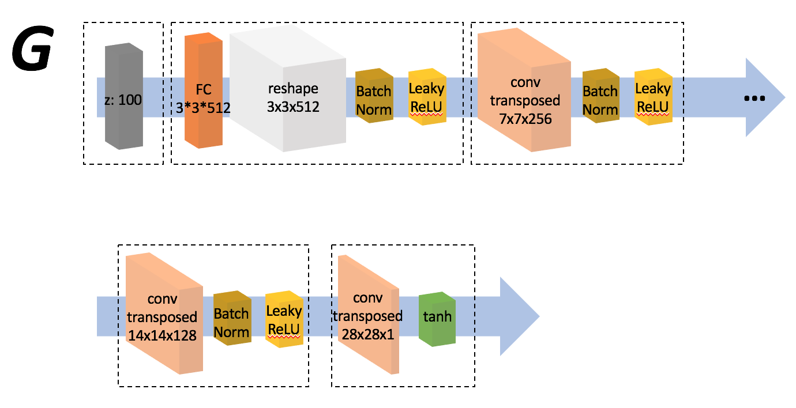
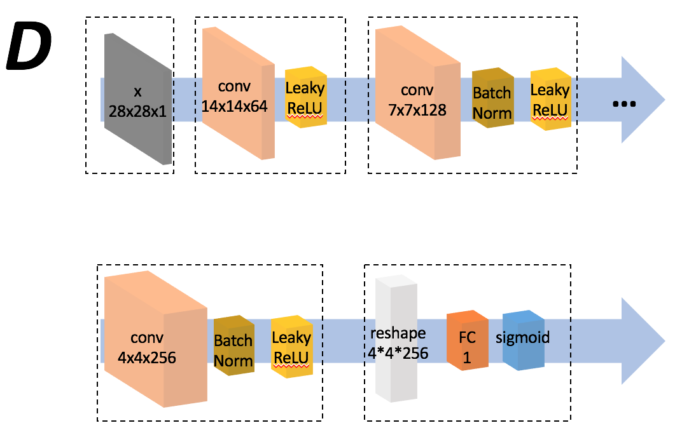
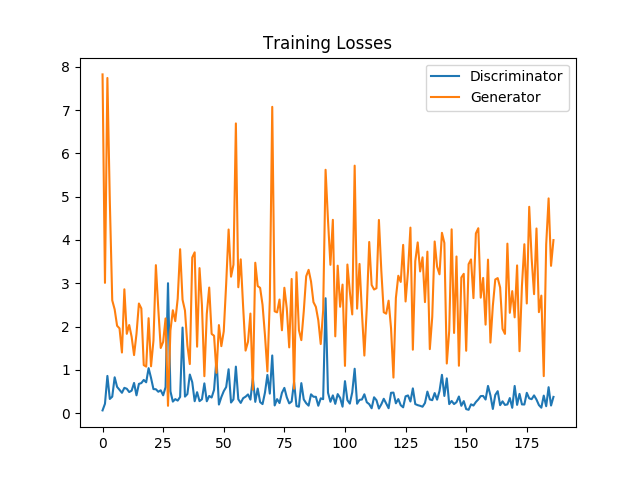
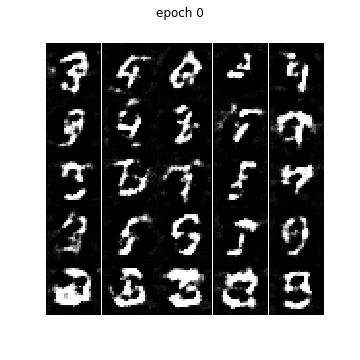

# DCGAN on MNIST dataset - tensorflow & pytorch

## Network at a glance
**Generator**

**Discriminator**

### Training Losses

### Generated samples via epochs

### Generated samples with trained model

