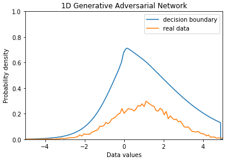
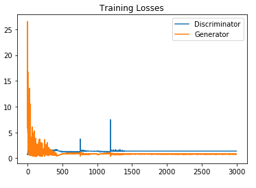
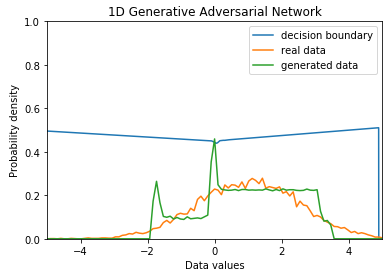
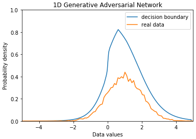
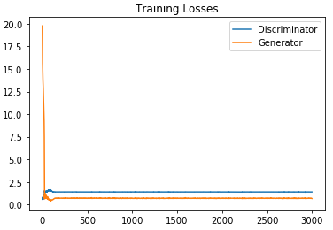
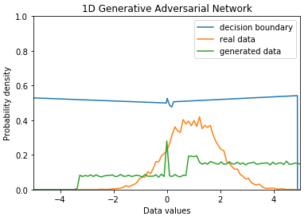
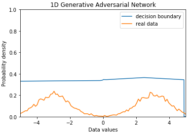
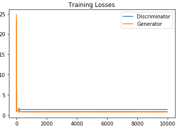
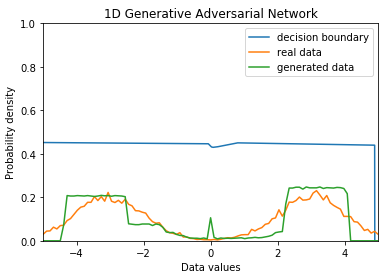

# GAN(Generative Adversarial Network) with 1D Gaussian distribution

## Reference
1. http://blog.aylien.com/introduction-generative-adversarial-networks-code-tensorflow/
2. http://blog.evjang.com/2016/06/generative-adversarial-nets-in.html
3. https://github.com/hwalsuklee/tensorflow-GAN-1d-gaussian-ex
4. https://medium.com/@devnag/generative-adversarial-networks-gans-in-50-lines-of-code-pytorch-e81b79659e3f

### In tensorflow - 1D Gaussian(mu, sigma = 1.0, 1.5)

Initial decision boundary after pre-training:  

Training loss:  

Result:  

### In pytorch - 1D Gaussian(mu, sigma = 1.0, 1.0)

Initial decision boundary after pre-training:  

Training loss:  

Result:  

### In tensorflow - 1D Mixture of Gaussian(mu1, sigma1, mu2, sigma2 = -3.0, 1.0, 3.0, 1.0)

Initial decision boundary after pre-training:  

Training loss:  

Result:  

### Note on implementation

* Use weight initialization with truncated normal
* Don't use activation function on generator and no normalization on input
* Use optimzer with gradient descent
