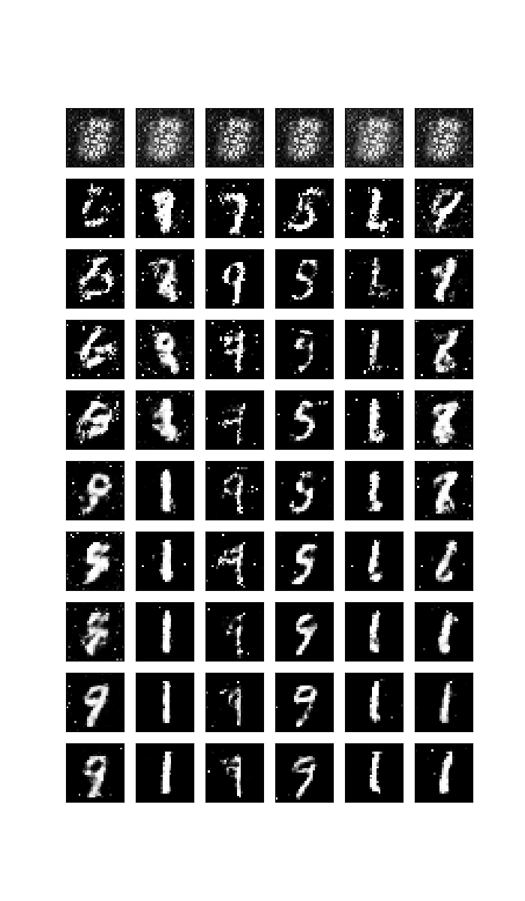
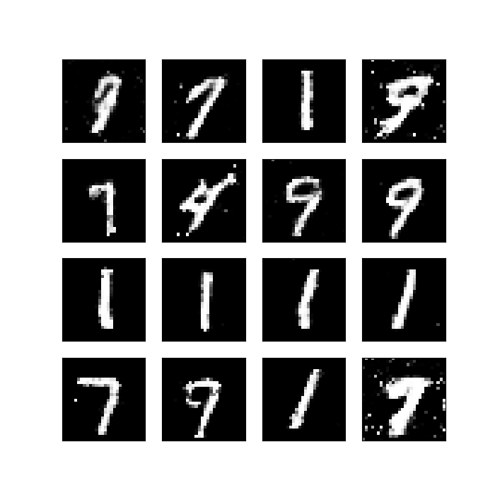

# GAN on MNIST dataset - tensorflow & pytorch

## Network at a glance

| **Generator**, **Discriminator** |
| --- |
|  |

### Training Losses

| tensorflow | pytorch |
| ---------- | ------- |
|  |  |

### Generated samples via epochs

| tensorflow | pytorch |
| ---------- | ------- |
|  |  |

### Generated samples with trained model

| tensorflow | pytorch |
| ---------- | ------- |
|  |  |
